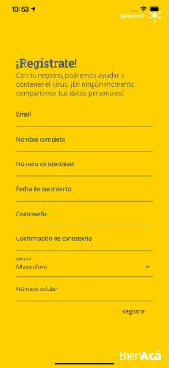
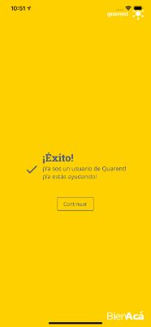
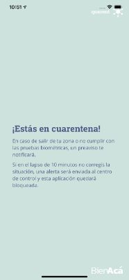
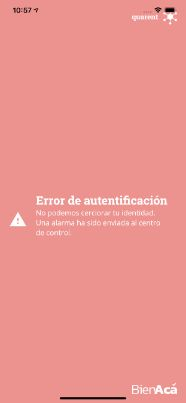
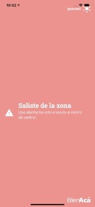
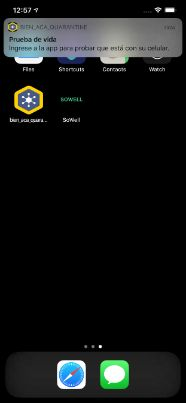

(Readme También disponible en español)

## **Readme**

**Keeping track of subjects under mandatory quarantine is a complex task.** There are just not enough resources to certify that every individual is compliant and a single rogue individual can spread the virus in a way that can spiral out of control. Take Korea’s patient 31 as an example, a super spreader that caused a successful, globally appraised, strategy to fail.

**The intuitive approach is to keep track of an individual location and automatically launch an alert to the control team** This is Korea’s approach and has been successful. They legally prohibit subjects from leaving their home, track their cellphones and a case oficial checks on them 2 times a day.

But it might be a little more difficult to implement when individuals are **actively trying to escape the quarantine and trying to devise ways to trick the system**, something we foresee in less compliant cultures. A drug addict (or any individual with high enough motivation to leave) would **wait for the oficial to call him to leave the house without the phone** and get his fix.

Another big issue is that every government is developing their own, quite similar solution, and **no other collaborative efforts have been established** (that we are aware of), everyone is starting from scratch.

**This is why we designed BienAcá, an open source solution, that enables any country or organization, to create their own solution out of this codebase. And that includes strategies to actively discourage the rogue subjects with little to non extra effort from the control mechanisms.**

Using the fingerprint scanner we introduce biometrics checks to the standard solution, to ensure the subject, and not somebody else, is with the device. But that’s not enough, we introduce randomness to prevent the user to figure out, and play, the system.

### **How does it work?**

1. An app is installed in the subject mobile phone. This app sends location information to a central system.
2. If there is no contact with the device (the device loses connectivity, is turned off, etc) or the device leaves the designated area a pre alert is sent to the subject asking to solve the issue
3. If the cause of the pre alert is not solved, (return to area, connect to internet, etc..) the system notifies the control center for them to deal with the incident by calling the subject or whatever action they see fit.
4. Several times a day, randomly, the app requires the user to identify himself using the fingerprint scanner. If the user fails to do so, an alert is sent to the control center.

### **Things developed on the mobile app**

- User registration
- Geofencing service
- Heartbeat report
- Biometric test
- Notifications

### **Things developed on the Backend**

- Register and Login
- Heartbeat system
- Admin dashboard

### **Mobile todo**

- Pre-alert the user 
- Biometric test randomization

## **Calm during the pandemic & features that can be used after the storm ��**

**BienAcá** can be easily deployed and is highly customizable; two characteristics are handy when dealing with a crysis. 

It was designed to be useful during and after the pandemic:

**Team coordination:** Coordination is key during a crisis. This app allows to centralize and simplify alarms and events

**Medical supplies management** It can be used to oversee resources as UCI beds, expensive equipment and materials to keep a real time track of each one of them

**Information about a possible interaction with a confirmed case** | Using location information we can notify all users that have been next to a confirmed case that they have been in close proximity to a confirmed case.

**Management and verification of permits** | Once an individual is immune to the disease and is certain to return to work, they are awarded a digital certificate linked to the clinical test that enables them to freely circulate again.

**After the health crisis, it can be used for low-risk precautionary measures,** such as the prohibition of attending certain meetings, venues or public shows, or visiting certain places or approaching certain people.
​
​
​
​
​
​
## README En español!

###  Actuar bien, hoy y rápido

Desarrollamos **Bien Acá**, una solución Open Source gratuita compuesta de herramientas fundamentales, expandibles y totalmente customizables, para que puedas ocuparte de lo más importante: seguir salvando vidas en tu país.

El sistema funciona con un único y simple centro de control que recibe alertas sobre los dispositivos vinculados y así puede centrar sus esfuerzos en aquellas incidencias que lo requieran, activando llamadas, protocolos e inspecciones solamente en casos estrictamente necesarios, potenciando sus capacidades y la gestión de los recursos.

## Control de cuarentena obligatoria ��
Controlar una cuarentena obligatoria se vuelve cada vez más complejo a medida que el número de casos requeridos aumenta. Existen soluciones en el mercado basadas en rastreo móvil que notifican al centro de control si el dispositivo sale de una zona determinada, aunque no aseguran que el individuo se encuentre efectivamente junto a dicho dispositivo.

Nuestra solución utiliza el análisis biométrico para certificar y asegurar que es el sujeto quien no deja dicha zona y se encuentra con el dispositivo registrado.

### Cómo funciona
1. Se instala en el móvil de la persona a seguir una aplicación que envía información de geolocalización al sistema central.
2. De perderse contacto con el dispositivo (estado sin conectividad o apagado) o el dispositivo salga de la zona establecida, una primer alerta a modo de preaviso se genera para la persona. // *feature a implementar*
3. De no regresar a la zona establecida dentro del tiempo elegido por el prestador, una alerta es enviada: primero al usuario y luego al al centro de control.
4. Adicionalmente y varias veces al día de forma randómica, la aplicación pide al usuario certifique su identidad mediante sensor biométrico, en este caso, huella dactilar.
5. De no verificar identidad, se envía una alerta al centro de control.

*El sistema ha sido diseñado para desalentar las acciones no deseadas y minimizar el trabajo de los centros de control: cada vez que una alerta es enviada, es el usuario mismo quien recibe una notificación a modo de aviso previo en su dispositivo, ahorrando tiempo, esfuerzo y dinero a los prestadores.*

### Qué tenemos implementado Mobile
- Registración de usuario
- Servicio de Geofencing
- Heartbeat de reporte continuo
- Test biométrico
- Notificaciones

### Qué tenemos implementado Backend
- Registro y Login de usuario
- Sistema de Heartbeat
- Interface para admins

### Qué faltaría implementar Mobile
- Preaviso al usuario
- Randomización de prueba biométrica

### Qué faltaría implementar Backend
- Mandar emails de notificaciones

## Control y calma en tiempos de crisis ��
Creemos en **BienAcá** como una solución integral, de implementación rápida pero ampliamente flexible a las necesidades de un contexto en crisis. Fue diseñada para proveer tranquilidad y acierto en momentos extremos. Pensada para cuidar tiempo y dinero; creada para actuar hoy y estar tranquilos mañana.

**Coordinación entre equipos** | En tiempos de crisis la coordinación es fundamental y esta aplicación puede centralizar y simplificar alarmas y eventos.

**Manejo de recursos médicos** | Supervisar recursos tales como salas, equipamientos de alto costo y otros materiales para mantener un traqueo a tiempo real de los mismos.

**Información sobre posible interacción con caso confirmado** | La cuarentena voluntaria requiere de motivación por parte de la población. La aplicación puede ser modificada para notificar a la población que ha tenido contacto (mediante georeferenciación) con un caso conocido.

**Gestión y verificación de Permisos de salida** | Una vez que un individuo es inmune a la enfermedad y es seguro que retorne al trabajo, se le adjudica un certificado digital vinculado a la prueba clínica que lo habilita a volver a circular libremente.

**Luego de la crisis sanitaria puede ser utilizada para medidas cautelares de bajo riesgo** como la prohibición de asistir determinadas reuniones, recintos o espectáculos públicos, o de visitar determinados lugares o de aproximarse a ciertas personas.

## Screens :tv:

​
​
# Actuemos juntos!

